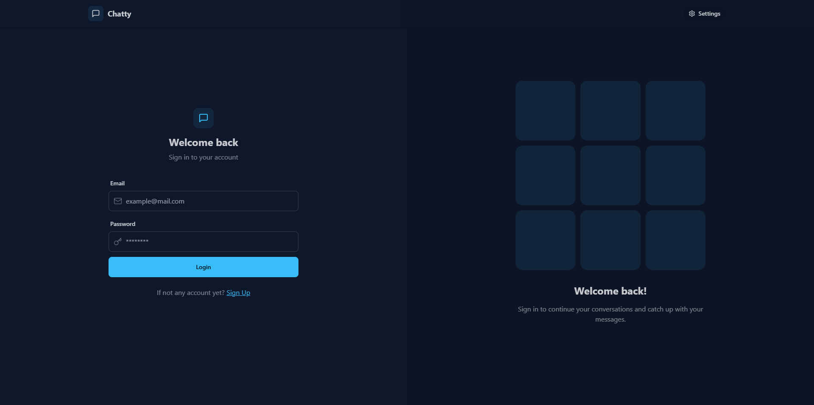
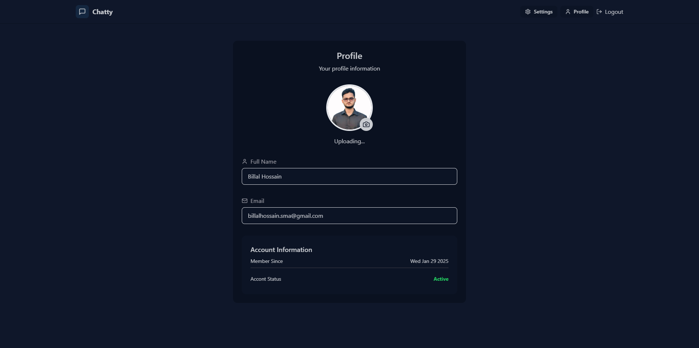
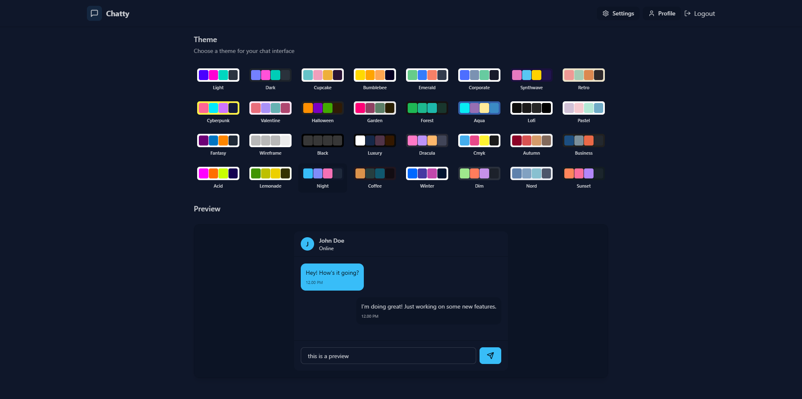

  

    <h1>MERN E-Commerce application.</h1>
    

      
      
      
      
    

    

      Build a Chat application using MERN Stack.
    

  

  

	<h1>Login Page</h1>
    
  

  
  

	<h1>Chat application</h1>
    
  

  

	<h1>Settings (upload profile to cloudinary)</h1>
    
  

  

	<h1>Themes</h1>
    
  

